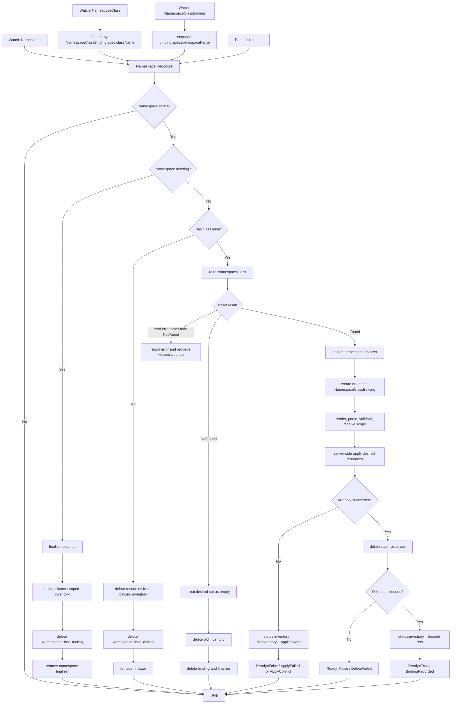

# Namespace Class

This repository hosts a Kubernetes controller solution for the NamespaceClass problem.

The controller will let cluster admins define a cluster-scoped `NamespaceClass` whose raw Kubernetes resource templates are reconciled for namespaces labeled with that class.

## Scope

The intended solution covers:

- `NamespaceClass` CRD for raw resource templates.
- Cluster-scoped `NamespaceClassBinding` CRD for durable inventory and per-namespace status.
- A controller that watches `Namespace`, `NamespaceClass`, and `NamespaceClassBinding`.
- Server-side apply for managed resources.
- Support for both namespaced and cluster-scoped resources.
- Template variables for namespace name, UID, labels, annotations, and class name.
- Runtime GVK allow/deny policy with `ClusterRoleBinding` denied by default.
- Namespace finalizer cleanup for cluster-scoped managed resources.
- First-slice drift repair through primary-object watches and periodic requeue.
- Local verification through Go tests, manifest validation, Helm rendering, and minikube smoke checks.

## Quick Start

```bash
make tools
export PATH="$PWD/.tools/bin:$PATH"
make doctor
make check
```

If minikube is running:

```bash
make cluster-check
make deploy-local
```

## Common Commands

```bash
make help              # list commands
make tools             # install project-local kubectl and helm
make envtest-tools     # prefetch project-local envtest apiserver/etcd binaries
make lint-tools        # install project-local golangci-lint
make doctor            # check local prerequisites
make build             # build controller binary
make container-binary  # build linux controller binary for container image
make mod-tidy          # tidy Go module files
make mod-check         # verify Go module files are tidy
make fmt               # check Go formatting
make lint              # run golangci-lint
make test              # run Go unit tests
make envtest           # run envtest-backed integration tests
make vet               # run go vet
make scripts-check     # check shell and Ruby script syntax
make manifests-lint    # validate CRD manifests with offline YAML/shape checks
make manifests-check   # backwards-compatible alias for manifests-lint
make helm-template     # render Helm chart
make check             # local aggregate verification
make cluster-check     # verify kubectl can reach minikube/current cluster
make deploy-crds       # install CRDs into the current cluster
make wait-crds         # wait for CRDs to become Established
make undeploy-crds     # remove CRDs from the current cluster
make deploy            # install or upgrade the controller Helm chart
make wait-controller   # wait for controller Deployment availability
make restart-controller # restart controller Deployment after loading a same-tag local image
make image-build       # build namespace-class-controller:dev locally
make image-load        # load namespace-class-controller:dev into minikube
make deploy-local      # build, load, install, restart, wait, and smoke-test locally
make undeploy-local    # uninstall the local controller Helm release
make smoke             # run cluster smoke checks
make rbac-check        # inspect deployed controller ServiceAccount RBAC
make clean             # remove local build outputs
```

`make deploy-local` uses a unique local image tag derived from `IMAGE_TAG` and the current timestamp so minikube does not reuse an older same-tag image.

`make envtest` runs `make envtest-tools` automatically. Run `make envtest-tools` directly when you want to prefetch or refresh the envtest assets before the full verification path.

`make smoke` always checks CRDs and server-side sample validation. It runs full controller behavior checks only when the controller Deployment is installed in `RELEASE_NAMESPACE`.

## Current State

The repository contains a working controller implementation for the core NamespaceClass flows: binding labeled namespaces, applying arbitrary raw resource templates, recording durable inventory, switching classes, handling class updates/deletion, cleaning cluster-scoped resources during namespace deletion, enforcing the runtime GVK policy, and repairing drift through primary-object watches plus periodic requeue.

The local harness supports unit tests, envtest-backed controller integration tests, linting, manifest checks, Helm rendering, minikube deployment, smoke tests, and live RBAC inspection.

## Controller Flow

All managed resource mutations go through namespace reconciliation. `NamespaceClass` and `NamespaceClassBinding` watches only enqueue affected namespaces; they do not apply resources directly.



## Project Notes

- Design lives in `docs/design/namespaceclass-design.md`.
- Chinese design reference lives in `docs/design/namespaceclass-design-zh.md`.
- Implementation plans live in `docs/plans/`.
- Progress tracking lives in `docs/progress/`.
- Tools installed by `make tools` are local to `.tools/bin` and are ignored by git.
